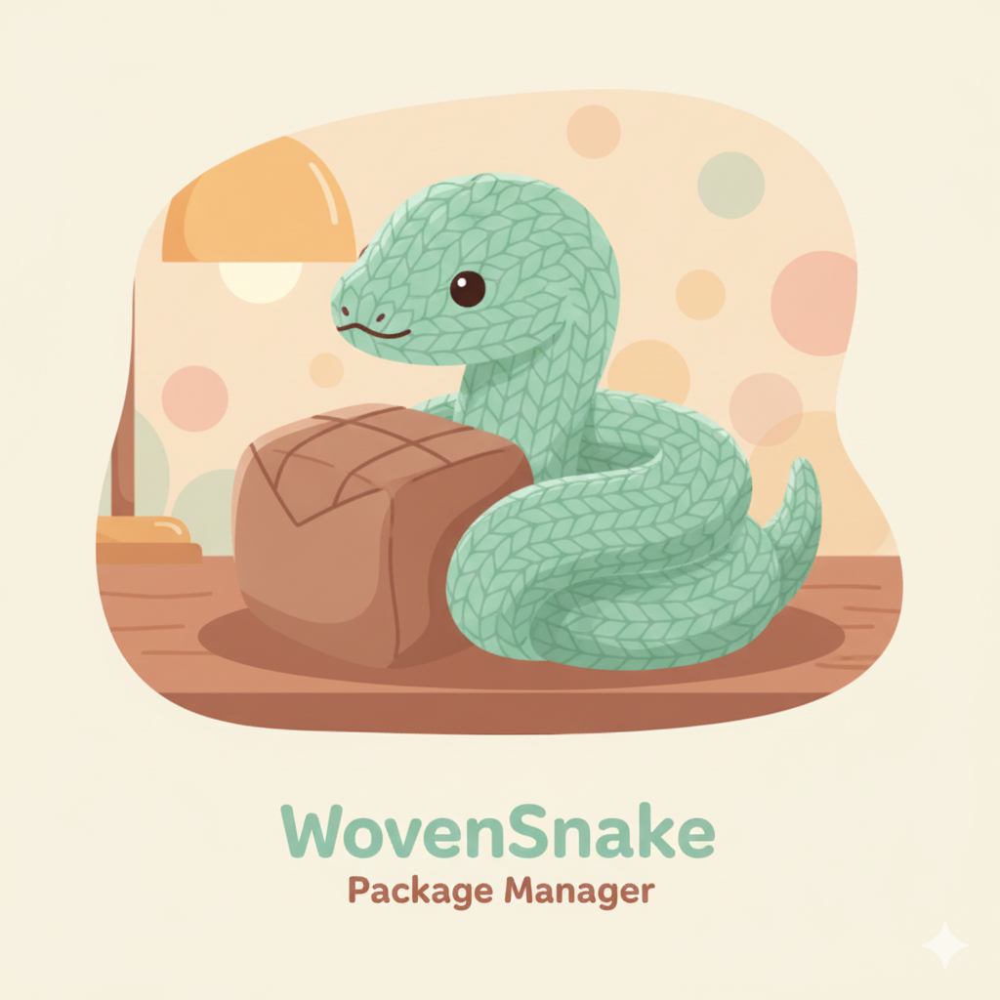

<div align="center">
  
  <h1>🧶 WovenSnake</h1>
</div>

[](https://crates.io/crates/wovensnake)
[](https://docs.rs/wovensnake)
[](https://github.com/jackby03/wovensnake/actions)
[](https://github.com/jackby03/wovensnake/blob/main/LICENSE)
[](https://ko-fi.com/jackby03)

> **"Dependencies, neatly woven."** 🐍🧶

**WovenSnake** is a cozy, high-performance Python package manager built with **Rust**. It knits your dependencies together securely, keeping your environment warm and tidy.

---

## 🍵 Why WovenSnake?

Managing packages shouldn't be a tangle. WovenSnake keeps things organized:
*   **⚡ Swift Knitting**: Parallel resolution and installation that finishes before your tea is ready.
*   **🔒 Secure Stitching**: Deterministic `wovenpkg.lock` ensures every install is identical.
*   **📦 Global Cache**: Shared storage in `~/.wovensnake/cache` to avoid downloading the same package twice.
*   **🌍 Truly Cross-Platform**: Native binaries for macOS (arm64 & x86_64), Linux, and Windows — no Rosetta 2 penalty on Apple Silicon.
*   **🧶 Self-Mending**: Automatically removes loose threads (unused packages) to keep your project clean.
*   **🏠 Zero-Config Home**: Creates virtual environments automatically, so your packages have a safe place to live.

---

## 💻 Platform Support

| Operating System | Architecture | Status |
| :--- | :--- | :--- |
| **macOS** | Apple Silicon (arm64) | ✅ Supported |
| **macOS** | Intel (x86_64) | ✅ Supported |
| **Linux** | x86_64 | ✅ Supported |
| **Linux** | aarch64 | ✅ Supported |
| **Windows** | x86_64 | ✅ Supported |

---

## 💿 Installation

### 🚀 Automatic (Recommended)

**macOS / Linux**:
```bash
curl -fsSL https://raw.githubusercontent.com/jackby03/wovensnake/main/scripts/install.sh | bash
```

The installer auto-detects your architecture (arm64 or x86_64), downloads the right binary, and optionally adds `woven` to your PATH. Pass `--yes` to skip all prompts.

**Windows (PowerShell)**:
```powershell
iwr -useb https://raw.githubusercontent.com/jackby03/wovensnake/main/scripts/install.ps1 | iex
```

### 📦 Pre-built Binaries

Download the binary for your platform from the [latest release](https://github.com/jackby03/wovensnake/releases/latest):

| Platform | Binary |
| :--- | :--- |
| macOS (Apple Silicon) | `woven-macos-arm64` |
| macOS (Intel) | `woven-macos-amd64` |
| Linux (x86_64) | `woven-linux-amd64` |
| Windows (x86_64) | `woven-windows-amd64.exe` |

### 🦀 From Source (Rustaceans)
```bash
cargo install --path .
```

### ♻️ Updating

Re-run the installer — it will overwrite the existing binary:

```bash
curl -fsSL https://raw.githubusercontent.com/jackby03/wovensnake/main/scripts/install.sh | bash
```

### 🗑️ Uninstalling

```bash
# 1. Remove the binary
rm -f ~/.local/bin/woven

# 2. Remove the PATH entry added by the installer (if any)
#    Edit ~/.bashrc, ~/.zshrc, or ~/.profile and delete the line:
#    export PATH="$HOME/.local/bin:$PATH"

# 3. (Optional) Remove the global cache and managed Pythons
rm -rf ~/.wovensnake
```

On **Windows**, delete `%USERPROFILE%\.local\bin\woven.exe` and remove the corresponding entry from your user `PATH` in System Properties.

---

## 🎮 How to Use

### 1. Start a New Pattern (`init`)
Prepares `wovenpkg.json` for your project.
```bash
woven init
```

### 2. Add a New Thread (`add`)
Adds a package from PyPI to your project and installs it immediately.
```bash
woven add requests
```

### 3. Knit Dependencies (`install`)
Reads your pattern, gathers materials, and weaves the environment.
```bash
woven install
```

### 4. Run in the Nest (`run`)
Execute any command within the context of your virtual environment.
```bash
woven run python main.py
```

### 5. Tidy Up (`remove`)
Gently removes a package and its unused threads.
```bash
woven remove flask
```

### 6. View the Tapestry (`list`)
Admire the packages currently woven into your project.
```bash
woven list
```

### 7. Fresh Start (`clean`)
Clears the virtual environment and local packages. Use `--all` to clear the global cache too.
```bash
woven clean
```

---

## 🧸 Support the Nest

Building such a cozy tool takes care and patience. If WovenSnake brought you comfort, consider supporting:

<p align="center">
  <a href="https://ko-fi.com/jackby03"></a>
  <a href="https://publishers.basicattentiontoken.org/en/c/jackby03"></a>
</p>

---

## 🤝 Contributing to the Nest

We follow a **Trunk-Based Development** workflow with strict CI verification. Check out **[CONTRIBUTING.md](CONTRIBUTING.md)** to get started.

## 📜 Licenssse

This project is licensed under the **MIT License**. Ssssee [LICENSE](LICENSE) for details.
