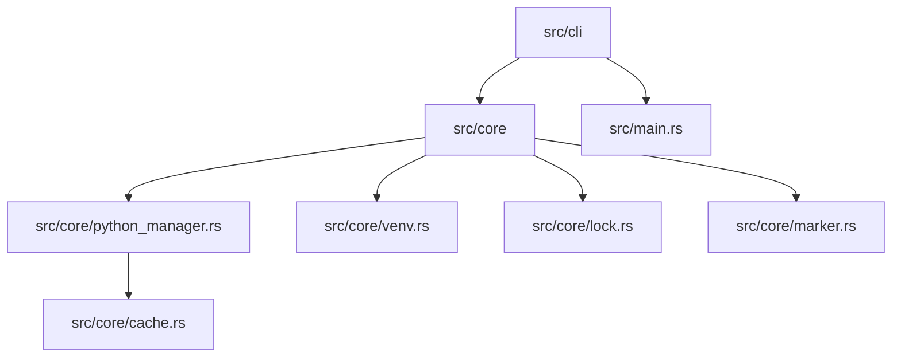

# WovenSnake Architecture

This document provides a high-level overview of how WovenSnake is structured.

## 🏗️ System Overview

WovenSnake is a Rust-based CLI that manages Python environments and dependencies.

## 📂 Core Components

### 1. CLI Layer (`src/cli/`)
*   Uses `clap` for command definition and argument parsing.
*   Maps CLI commands (init, install, list, run, clean) to core functions.

### 2. Core Logic (`src/core/`)
*   **`python_manager.rs`**: Handles downloading and managing standalone Python distributions.
*   **`venv.rs`**: Manages the creation and activation of virtual environments.
*   **`lock.rs`**: Handles the `wovenpkg.lock` file format and serialization.
*   **`marker.rs`**: Implements PEP 508 environment markers parsing and evaluation.
*   **`cache.rs`**: Manages the download cache for Python binaries.

### 3. Dependencies (`src/dependencies/`)
*   Handles parsing of `wovenpkg.json` and external dependency resolution.

## 🔄 Key Flows

### Install Flow
1. Parse `wovenpkg.json`.
2. Check if the required Python version is installed (via `python_manager`).
3. Create/Update virtual environment (via `venv`).
4. Resolve dependencies and satisfy them in the venv.
5. Generate/Update `wovenpkg.lock`.

### Execution Flow (`woven run`)
1. Detect project context (`wovenpkg.json`).
2. Identify the correct venv paths.
3. Proxy the command to the venv's Python/Scripts.
